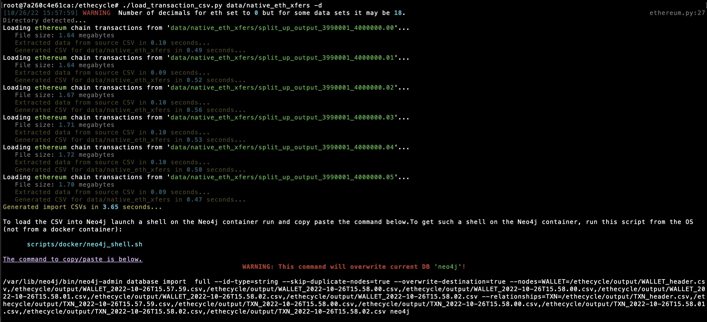

# Transaction Graph DB
* Wallet addresses are vertices AKA nodes. All vertices currently use the label `wallet` so the `.hasLabel()` predicates seen in many tutorials are irrelevant and do not need to be used.
* Transactions are edges and contain properties like `value`, `block_number`, etc. All edges use the label `transaction` so the same rule applies. Theoretically we could distinguish `ETH` txions from `ERC20` txions from gas fees from swaps etc. down the road but for now they're just `transaction`.
* Look in [Graph](ethecycle/graph.py) for examples of queries that actually work.

### Prerequisites
This is known to work with these versions of `docker` and `docker-compose`.

```
$ docker-compose --version
Docker Compose version v2.10.2

$ docker --version
Docker version 20.10.17, build 100c701
```

# Usage
To launch docker containers and load graph data:

```bash
# Clone repo and cd into the repo directory
git clone https://github.com/michelcrypt4d4mus/ethecycle.git
cd ethecycle

# Edit local copy of .env to set TXION_DATA_DIR as the location of some txion CSVs
cp .env.example .env
cp .env.neo4j.example .env.neo4j

# Use vi or whatever editor you prefer to set variables in .env
vi .env

# Run script to get JVM settings for neo4j once you have allocated docker memory:
scripts/docker/neo4j/generate_.neo4j.env_file.sh  # Add -h for help

# When you run this command docker-compose should build everything and leave you in a
# bash shell, at which point you can run 'bpython' to get a python REPL etc.
scripts/docker/python_etl_shell.sh
```

## Loading Data
Once you are in the container shell the `./load_transaction_csv.py` script will prep files for bulk load. This approach uses the `neo4j-admin database import` tooling ([documentation](https://neo4j.com/docs/operations-manual/current/tools/neo4j-admin/neo4j-admin-import/)) which is theoretically significantly faster than `LOAD CSV` at getting data from the disk and into Neo4j.

The loader takes a directory of CSVS (or a single CSV), processes them to add some columns (e.g. `token_symbol` and `blockchain`), does decimal conversion where it can, etc., and writes 2 output CSVs for each input CSV (wallets, txns, and headers for each) to the `output/` directory along with 2 one row CSVs for the wallet and transaction headers. When the preprocessing is complete it will print a shell command to the screen that you can run in the `neo4j` docker container.

How to run it:
```bash
# Show help:
./load_transaction_csv.py --help

# First time you must run with --drop to overwrite the database called 'neo4j'. (Community edition
# only allows one database and it must be called 'neo4j'.)
./load_transaction_csv.py /path/to/transactions.csv --drop

# You can also run it against an entire directory of CSVs:
./load_transaction_csv.py /path/to/transactions/ --drop

# Load only USDT txions
./load_transaction_csv.py /path/to/transactions.csv --token USDT --drop
```

Example output:



### Running From Outside Of Docker Container
Cannot guarantee these steps work but they probably will work.

1. Create a virtual env in the project dir: `python -m venv .venv`
1. Activate the venv: `. .venv/bin/activate`
1. Checkout [the ethereum token data git repo](https://github.com/ethereum-lists/tokens.git) somewhere on your file system.
1. When running the loader script, you need to specify the parent dir of the token data repo with the `TOKEN_DATA_REPO_PARENT_DIR` environment variable. Example:
   ```bash
   TOKEN_DATA_REPO_PARENT_DIR=/Users/uzer/github_repos ./load_transaction_csv.py data/output_1000_lines.csv
   ```

## Queries
Some queries can be found in the [`queries/`](queries/) folder.

#### Index Creation Queries
Some reasonable guesses as to useful ways to index transactions can be found [here](queries/indexes.cql).

## Other Useful Commands
1. Generate `.env.neo4j` file ([example](.env.neo4j.example)): `scripts/docker/neo4j/generate_.neo4j.env_file.sh -h`
1. Get shell on the Neo4j server: `scripts/docker/neo4j/shell.sh`


# Neo4j
**IMPORTANT:** The community edition only allows you to have one database per server and it must be called `neo4j`.

After starting you can browse to [http://localhost:7474/browser/](http://localhost:7474/browser/) to run queries.

Alternatively (and more 'performantly') Neo4j makes a desktop application.

### Running Queries
* Addresses start with `0x` (same as etherscan)
* All addresses in the DB are lowercased.  (You can use `toLower()` on an address of mixed/upper case.)


### Other Resources

* [Official Cypher Introduction](https://neo4j.com/docs/getting-started/current/cypher-intro/). Cypher is Neo4j's custom query language.
* [Cypher query style guide](https://s3.amazonaws.com/artifacts.opencypher.org/M20/docs/style-guide.pdf)
* [Official Neo4j on Docker documentation](https://neo4j.com/developer/docker-run-neo4j/)
* [Neo4j ETL Tool](https://neo4j.com/developer/neo4j-etl/) Claims to be able to connect to an RDBMS and port data quickly.
* [Neo4j Desktop](https://neo4j.com/developer/neo4j-desktop/)
* [CSV header format docs](https://neo4j.com/docs/operations-manual/current/tools/neo4j-admin/neo4j-admin-import/#import-tool-header-format)
* [Neo4j LOAD CSV example](https://neo4j.com/blog/neo4j-call-detail-records-analytics/) that creates nodes from a single relatonships file.
* [Neo4J operations manual](https://neo4j.com/docs/operations-manual/current/)
* [5 Tricks for Batch Updates](https://medium.com/neo4j/5-tips-tricks-for-fast-batched-updates-of-graph-structures-with-neo4j-and-cypher-73c7f693c8cc)
* [Neo4j admin tools/config](https://neo4j.com/docs/operations-manual/current/tools/neo4j-admin/)
* [Article on supernodes and Neo4j](https://medium.com/neo4j/graph-modeling-all-about-super-nodes-d6ad7e11015b)

# Questions
1. IIRC you said the txion amounts were already correctly adjusted for decimals?  (AKA divided by `10^18` for most tokens)
1. Current unique ID for edge is `transaction_id = f"{self.transaction_hash}-{self.log_index}"`. Does that make sense?
1. Do you have a rough estimate as far as blocks per hour and/or blocks per day?
1. Are there lists of tokens with their contract addresses available somewhere for each blockchain? (Esp. any blockchains we may care about)

# Potential Queries
1. Identify the largest short term pass through wallets (AKA wallets with large xfers in and out in a short time frame that end up w/0 balances and are not used again)

# (DEPRECATED) Gremlin Resources
* [Gremlin Query Cheat Sheet](https://dkuppitz.github.io/gremlin-cheat-sheet/101.html), [Advanced Cheet Sheet](https://dkuppitz.github.io/gremlin-cheat-sheet/102.html) (includes `cyclicPath()` element)
* [Gremlin query book by Kelvin Lawrence](https://kelvinlawrence.net/book/Gremlin-Graph-Guide.html). Best resource I have found. Note these are not in python so the code may be slightly different than shown.
* [Tinkerpop Gremlin official documentation](https://tinkerpop.apache.org/docs/current/reference/#_tinkerpop_documentation)
* [Gremlin traversal steps documentation](https://tinkerpop.apache.org/docs/current/reference/#general-steps)
* [Domain Specific Language Writing](https://tinkerpop.apache.org/docs/current/reference/#gremlin-python-dsl)
* [Gremlin Python common imports](https://tinkerpop.apache.org/docs/current/reference/#python-imports)
* [Gremlin algorithm development](https://recolabs.dev/post/gremlin-python-algorithm-development-from-the-ground-up)
* [More Gremlin examples](https://www.doanduyhai.com/blog/?p=13374)
* [Tuning Gremlin queries](https://docs.aws.amazon.com/neptune/latest/userguide/gremlin-traversal-tuning.html)
* [Air routes `graphml`](https://raw.githubusercontent.com/krlawrence/graph/master/sample-data/air-routes-small-latest.graphml) Useful data to learn with. Can be loaded with script in repo by running: `scripts/demo_data/load_air_routes_demo_data.py`

### Other Technologies
  * [Bulk load data into Neo4j](https://neo4j.com/docs/operations-manual/current/tools/neo4j-admin/neo4j-admin-import/)
* [ArangoDB](https://www.arangodb.com/) - Second most commonly recommended after Neo4j.
* [Apache AGE](https://age.apache.org) - Postgres extension. No Tinkerpop support, only OpenCypher.
* [ArcadeDB](https://arcadedb.com) - New fork of OrientDB. Gremlin and OpenCypher support.
* [MemGraph](https://memgraph.com) - In memory graph DB.
* TigerGraph comes up sometimes

### Other Resources


